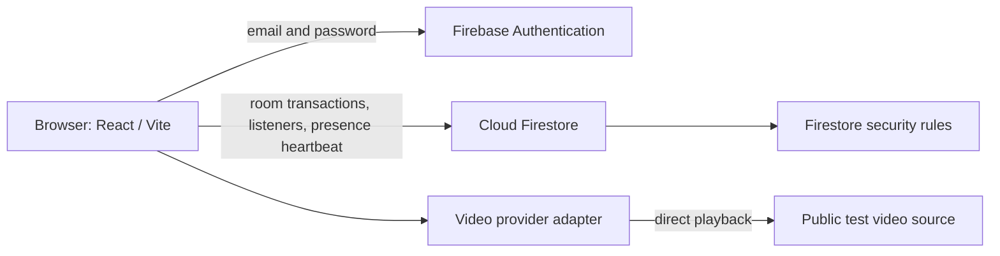
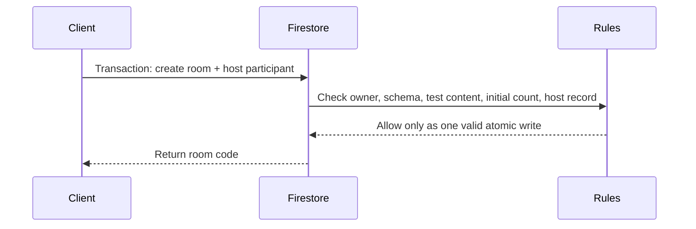
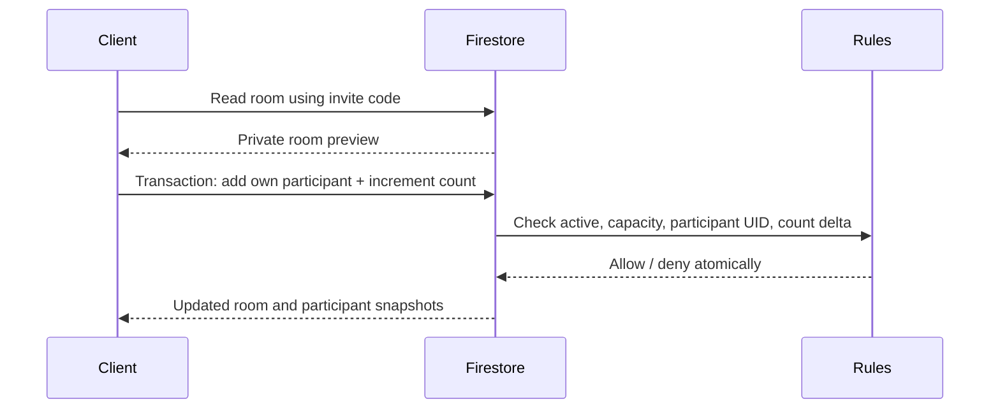
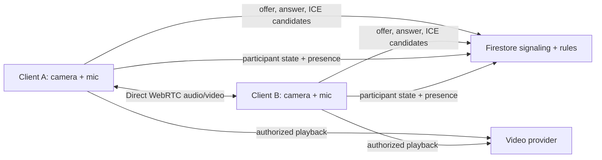

# Social Cinema architecture

## Implemented: UI, authentication, and rooms

Firebase Auth identifies a user. The browser uses Firestore transactions for room creation and membership changes; rules validate every write, including host identity, participant ownership, participant counts, room capacity, and host transfer. A six-character room code is an unlisted invite capability. A signed-in user with the code can read the room preview, but only a room member can list participants or read member documents. Room listings are disabled.

Presence is a Firestore `online` flag refreshed every 25 seconds while the player is open. A page-hide signal attempts to mark the user offline. Browsers cannot guarantee this cleanup on a crash or network loss, so true disconnect presence and stale-member cleanup remain future work. Camera and microphone are live through browser WebRTC. Chat, reactions, and playback events are not persisted or shared yet.

Configuration is provided by the four `VITE_FIREBASE_*` variables. Firebase web configuration is visible to clients by design; Firestore security rules are the access boundary. No admin SDK or service account key is placed in the browser. Use a dedicated Firebase project for this app.

## Rule-validated room transaction flows

### Create

### Join / leave

On host leave, one Firestore transaction promotes the earliest joined remaining participant, removes the old host membership, and decrements the count. If no one remains, it closes the room. The Firestore emulator rule tests cover these changes.

## Implemented: real-time media

The browser requests local tracks after the user opens the pre-join screen. Each pair of room participants establishes one direct peer connection. Lexically sorted Firebase UIDs select one offerer to prevent duplicate negotiations. Firestore stores only signaling messages; camera and microphone tracks are not sent through Firestore or an application server. Leaving closes peer connections and stops local tracks.

This mesh uses Google's public STUN endpoint and has no TURN relay. Direct connection can fail behind restrictive NATs or firewalls, and upload/device load grows with each participant. Use a credentialed TURN service or managed SFU before relying on larger or production rooms. Playback synchronization should keep a compact authoritative state `{state, position, updatedAt, controllerId}` and compare client positions periodically. The movie itself remains between each device and its authorized provider; it is never relayed through our servers.

## Next: synchronized playback and social events

## Provider boundary

The player consumes normalized metadata (`provider`, `contentId`, `title`, `thumbnail`, `duration`) and a playback adapter with initialize/state/play/pause/seek/dispose operations. `TestVideoProvider` is the first catalog. Future adapters must use officially authorized APIs or SDKs and follow the provider's rules. No unsupported OTT embedding, scraping, DRM circumvention, extraction, or redistribution belongs in this system.

## Operational notes

- Auth, room creation/joining, and participant presence require a dedicated Firebase project and the public web-app config variables.
- Deploy `firestore.rules` before allowing real users to join rooms.
- The test suite uses a demo project ID and the local Firestore emulator; it does not contact production Firebase.
- Adding server-side functions or a managed SFU may introduce billing and deployment requirements. Evaluate those separately before enabling paid services.
