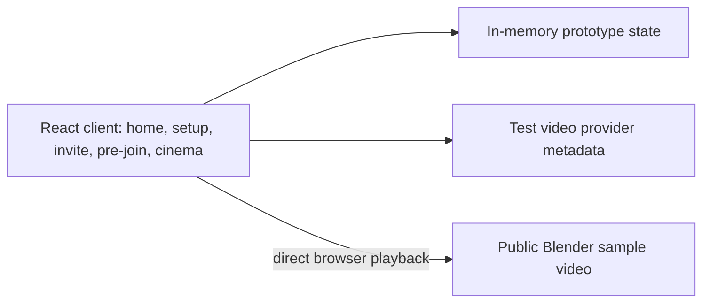
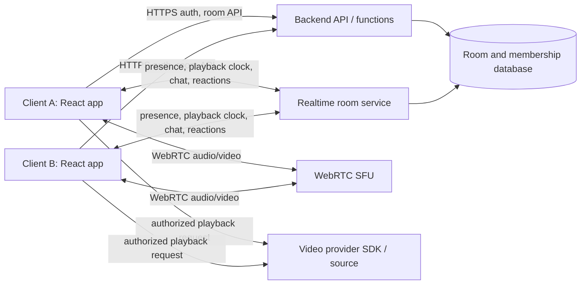

# Social Cinema architecture

## Phase 1 prototype

The UI currently runs as a single React/Vite application. The player is the center of the cinema view, while compact participant tiles sit in peripheral space. CSS viewing modes change how much space those tiles occupy. Content metadata is independent of UI presentation; the sample file is fetched directly by each browser. The remaining social and room data in this phase is demonstrative only.

## Target real-time architecture

The backend authenticates users and validates room membership, room capacity, host/moderator roles, playback permissions, lock state, participant removal, and content selection. Clients must not be trusted to enforce these rules. The realtime service carries compact room events and presence; an SFU routes participant audio/video. The movie itself remains between the provider and each participant device.

## Playback synchronization target

Store `{ state, position, updatedAt, controllerId }` as authoritative room state. A room event updates state immediately on play, pause, and seek. Clients estimate current room position from the last authoritative position and timestamp, then compare their local provider position periodically. Ignore drift below 100 ms, gradually adjust playback rate for moderate drift (100–500 ms, when the provider permits), and seek for larger drift. Provider capabilities vary, so the adapter reports supported operations; provider-specific rules remain in the adapter.

## Provider adapter target

The player consumes normalized content metadata (`provider`, `contentId`, `title`, `thumbnail`, `duration`) plus a playback adapter with initialize/state/play/pause/seek/dispose operations. `TestVideoProvider` is the first implementation. Future implementations must use officially authorized SDKs/APIs and enforce each provider's playback requirements. No unsupported OTT embedding, scraping, DRM circumvention, stream extraction, or redistribution belongs in this system.

## Resilience and lifecycle

Presence should use leases/heartbeats and remove stale connections after a timeout. On reconnect, the client rejoins, restores permitted media tracks and fetches authoritative room state before resuming. When a host leaves, a trusted backend transaction selects an eligible next participant and changes ownership; when the last participant leaves, the room closes. Every media and realtime subscription has a leave/dispose path.

## Decisions still open for Phase 2+

- Select room database/realtime transport after defining consistency, latency, and deployment constraints.
- Select managed SFU based on expected geography, participant count, recording policy, and cost.
- Add environment variables only when the chosen services require them; public client configuration is not a secret, private service credentials stay server-side.
